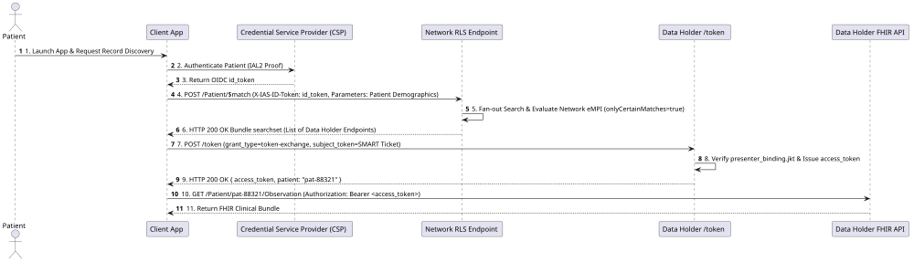
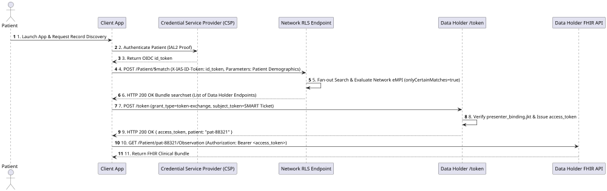
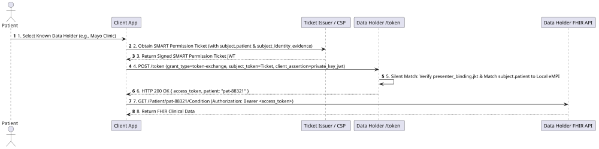
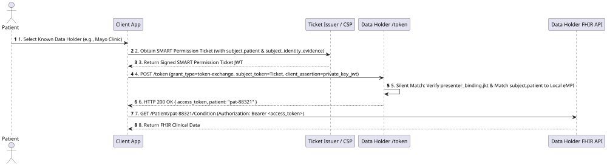

# End to End Workflow Narrative

This section provides a complete walkthrough of how Client Applications interact with CMS-Aligned Networks and Data Holders across two distinct operational pathways:

1. **Pathway A: Broad Network Discovery (Network RLS Search)** - Used when patient record locations are unknown.
2. **Pathway B: Targeted Direct Access (1-Step Token Exchange)** - Used when the target Data Holder is known.

---

## Registration Phase (Universal Prerequisite)

Regardless of query pathway, all Client Applications complete **RFC 7591 Dynamic Client Registration** once per target Data Holder or Network Authorization Server:
- **CMS App Library / NPD Listing**: App registers with CMS and obtains a CMS-signed software statement.
- **Dynamic Registration (`POST /register`)**: App submits `software_statement` + `client_assertion` (RFC 7523 key possession proof signed by its JWKS key).
- **Outcome**: Data Holder issues a unique `client_id` bound to the app's verified `jwks_uri`.

---

## Pathway A: Broad Network Discovery (Network RLS Search)

When a patient opens an application for the first time and wants to discover records across a network without knowing specific health system endpoints:

  

### Steps in Pathway A:
1. **Patient Authentication**: App authenticates patient via CSP, receiving an OIDC `id_token` (IAL2).
2. **Network RLS Query (`$match`)**: App sends `POST /Patient/$match` to the **Network RLS endpoint** with `X-IAS-ID-Token` header.
3. **Endpoint Discovery**: Network RLS returns a searchset `Bundle` listing the specific Data Holder endpoints where matching patient records were found.
4. **Targeted Token Exchange**: App presents a SMART Permission Ticket to each discovered Data Holder's `POST /token` endpoint to receive a FHIR `access_token`.

---

## Pathway B: Targeted Direct Access (1-Step Token Exchange)

When the target Data Holder is already known (e.g. selected by the patient, discovered in NPD, or associated with a prior claim), the application **skips `$match` entirely** and executes 1-step direct token exchange:

  

### Steps in Pathway B:
1. **Direct Token Exchange (`POST /token`)**: App presents the SMART Permission Ticket directly to the Data Holder's token endpoint using `grant_type=urn:ietf:params:oauth:grant-type:token-exchange`.
2. **1-Step Silent Resolution**: The Data Holder's authorization server verifies `presenter_binding.jkt` against the client's `client_assertion` key, validates `subject_identity_evidence`, and matches `subject.patient` demographics to local records.
3. **Token Issuance**: Data Holder returns `{ access_token, patient: "pat-88321" }` in **a single HTTP round-trip**.

---

## Ambiguous Match Fallback (`interaction_required`)

If silent identity matching yields multiple candidate records at a Data Holder during `POST /token`:
1. Data Holder returns `HTTP 400 Bad Request` with `error="interaction_required"` and a single-use `launch` context handle.
2. Client App opens an in-app browser view to `GET /authorize?client_id=...&launch=ctx-abc123XYZ`.
3. Patient interactively confirms their identity at the Data Holder.
4. Data Holder issues an authorization code, which the App exchanges at `POST /token` for the final `access_token`.
