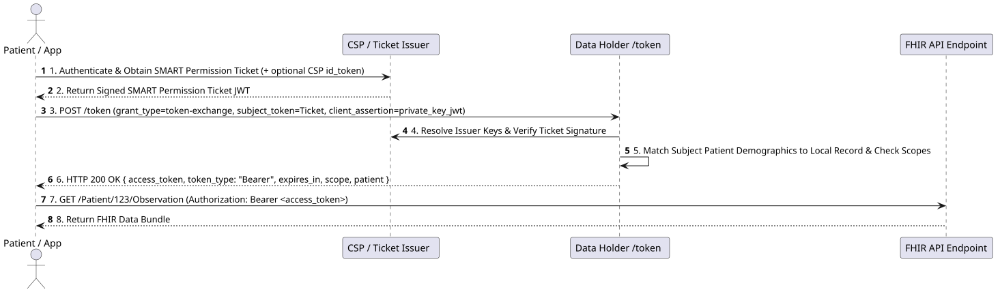
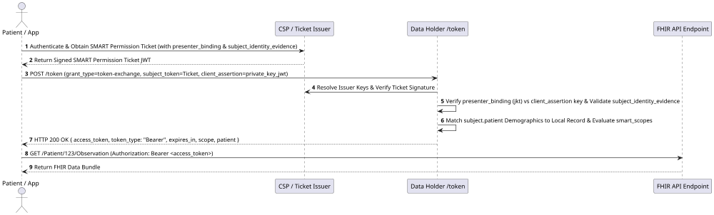
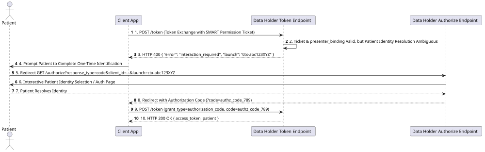
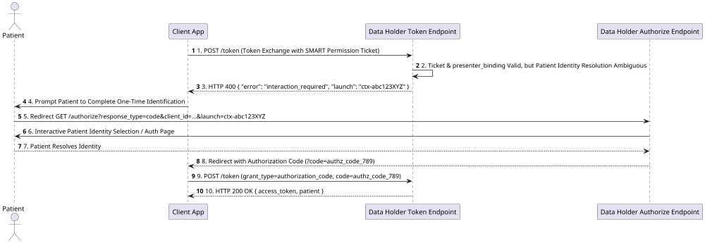

# Getting an Access Token

This section specifies the technical architecture, protocol requirements, and operational expectations for Client Applications to redeem SMART Permission Tickets for OAuth 2.0 access tokens when requesting Individual Access Services (IAS) from Data Holders within a CMS-aligned network.

---

## Architectural Overview & Context

In a CMS-aligned network, authorization operates via **decoupled permission delegation**. Rather than requiring a patient to log in interactively at every individual Data Holder's patient portal, authorization is captured centrally or upstream and encapsulated inside a cryptographically signed **SMART Permission Ticket**.

### Enhancing Patient & Network Use Cases

Consider a patient managing a chronic health condition who uses a Personal Health Record (PHR) application to aggregate medical history from multiple providers, labs, and health plans. 

1. **Seamless Patient Experience**: The patient authenticates once with an identity provider or Ticket Issuer (such as a CMS App Library or Credential Service Provider). Upon verifying patient identity and capturing explicit data-sharing consent, the Issuer generates a signed **SMART Permission Ticket**.
2. **Identity Evidence Verification (`subject_identity_evidence`)**: To establish strong identity assurance across distinct clinical networks, the ticket includes `subject_identity_evidence` containing an embedded OIDC `id_token`. This payload documents verified identity evidence (e.g., NIST SP 800-63-3 IAL2 identity verification events by a CSP). Data Holders verify this evidence to confirm that the patient's identity was vetted to the required assurance level.
3. **Disambiguation Policy for `subject.patient`**: Information in the `subject.patient` claim that is not present in a verified claim of the embedded `id_token` **MAY ONLY** be used to disambiguate when a matching algorithm from the *CMS-Aligned Patient Matching Specification* returns multiple candidate results. For example, if demographic matching returns 3 candidate records with identical confidence, a supplementary identifier in `subject.patient` (such as an MBI or MRN) that matches exactly 1 of those 3 candidates allows the Data Holder to resolve a single valid match.
4. **Cryptographic Presenter Binding (`presenter_binding`)**: To prevent stolen or leaked tickets from being redeemed by unauthorized rogue applications, tickets issued for Individual Access Services **SHALL** incorporate `presenter_binding` using the `jkt` (JWK Thumbprint) method. This binds the ticket specifically to the Client Application's public signing key. When redeeming the ticket, the Client Application presents a `client_assertion` signed by its private key. The Data Holder computes the JWK thumbprint (`jkt`) of the client's public key from the `client_assertion` (or retrieved from the client's `jwks_uri`) and verifies that it matches the `presenter_binding.jkt` claim inside the ticket.
5. **Decoupled Cross-System Retrieval**: Armed with this key-bound ticket, the PHR application can query each participating Data Holder (hospitals, clinics, health plans) automatically behind the scenes.
6. **Targeted Scopes & Period Constraints**: The ticket explicitly conveys the patient's identity (`subject.patient`), fine-grained SMART scopes (`smart_scopes`), and data date ranges (`data_period`), allowing Data Holders to grant precise access without requiring repetitive manual sign-ins.

### Key Participants & Roles

1. **Permission Ticket Issuer**: An authorized entity that issues signed SMART Permission Tickets. The Ticket Issuer MAY be a patient-facing Client Application, a Network Broker/Hub, a Credential Service Provider (CSP), a Health Plan, or another issuer entity type entirely. The Issuer authenticates the patient (e.g., at Identity Assurance Level 2 / IAL2), captures sharing consent, and issues a signed [SMART Permission Ticket JWT](https://build.fhir.org/ig/jmandel/smart-permission-tickets-wip/index.html).
2. **Client Application**: The application requesting patient data (e.g., a Personal Health Record or chronic disease management app). **Note**: A patient-facing application (or PHR) acting on behalf of the patient is explicitly considered a Client Application in this architecture. The Client Application registers dynamically with Data Holders as defined in [Registration](registration.html) and presents the Permission Ticket to obtain Data Holder-specific access tokens.
3. **Data Holder**: A healthcare provider system, EHR, or Health Plan exposing FHIR APIs. The Data Holder verifies the ticket signature against the Issuer's trusted public keys, evaluates access constraints and presenter bindings, matches the subject patient to a local record, and issues scoped access tokens.

> [!TIP]
> **App Developer Implementation Guidance**:
> - **Source of SMART Permission Ticket (`subject_token`)**: The Client Application obtains the SMART Permission Ticket JWT from an accredited Credential Service Provider (CSP) or Identity Authority upon successful IAL2 patient identity verification.
> - **OAuth Endpoint Discovery**: To locate a Data Holder's OAuth `/token` and `/authorize` endpoints, Client Applications **SHALL** fetch the SMART Configuration document located at `<Endpoint.address>/.well-known/smart-configuration` (where `Endpoint.address` is the FHIR base URL returned in the Network RLS `$match` response or discovered via the National Provider Directory).
> - **SMART v2 Scopes & Wildcard Authorization**: When calling `POST /token` for token exchange, the Client Application **SHOULD** specify standard SMART v2 scopes in the `scope` parameter. Use the wildcard scope `patient/*.rs` to represent a comprehensive request for **"get all of my records"** (or specify fine-grained scopes such as `scope=patient/Observation.rs patient/Condition.rs` for targeted clinical categories).

---

## Structure & Classification of SMART Permission Ticket Claims

A SMART Permission Ticket is a signed JSON Web Token (JWT) whose claims define identity assertion, access constraints, presenter binding, and lifecycle control. Implementers **SHALL** understand the distinction between claims embedded **within the Ticket JWT** versus parameters sent in the OAuth 2.0 `/token` HTTP exchange request.

### Ticket JWT Claims Classification

| Claim Category | Claim Name | Conformance | Description |
| :--- | :--- | :--- | :--- |
| **JWT Standard Claims** | `iss`, `sub`, `aud`, `exp`, `iat`, `jti` | **SHALL** | Standard OAuth/JWT envelope claims identifying the Ticket Issuer, ticket subject, target audience URI (e.g., `"https://hte.cms.gov/aligned-networks"`), expiration, and unique ticket identifier. |
| **Audience Classification** | `aud_type` | **SHALL** | Classifies the target audience type. **MUST** be `"trust_framework"` when redeeming across a network trust framework (with `aud: "https://hte.cms.gov/aligned-networks"`) or `"resource_server"` when scoped to a single Data Holder endpoint. |
| **Ticket Profile Classification** | `ticket_type` | **SHALL** | **MUST** be `"https://smarthealthit.org/permission-ticket-type/patient-self-access-v1"`. Specifies the permission ticket profile as an Individual Access Services (IAS) request issued pursuant to patient self-access rights. |
| **Subject Identity Claim** | `subject.patient` | **SHALL** | Contains a FHIR `Patient` resource representing the patient's demographic information (e.g., name, date of birth, identifiers, address). Data Holders use this claim to perform silent patient matching against local medical records. |
| **Identity Evidence Claim** | `subject_identity_evidence` | **SHALL** | An array containing identity evidence objects. For Patient Self-Access, this contains an embedded `id_token` payload. Identity assurance requirements for the embedded `id_token` **SHALL** meet the specifications detailed in [Identity and Patient Matching](statements-on-identity.html). |
| **Presenter Binding Claim** | `presenter_binding` | **SHALL** | A JSON object defining cryptographic binding to the presenting client. In this IG, `presenter_binding.method` **MUST** be `"jkt"`, containing the RFC 7638 SHA-256 JWK Thumbprint (`jkt`) of the Client Application's public key. |
| **Access Constraints Catalog** | `smart_scopes` | **SHALL** | A JSON array or string of SMART on FHIR access scopes (e.g., `["patient/*.rs"]`, `["patient/Observation.rs", "patient/Condition.rs"]`) authorized by the patient. |
| **Access Constraints Catalog** | `data_period` | **MAY** | Constrains data access to resources created or covering a specific time window (e.g., `start` and `end` timestamps). |
| **Access Constraints Catalog** | `data_holder_filter` | **MAY** | Restricts valid redemption to specific Data Holder organization identifiers or endpoints. |
| **Continuation Credential Claim** | `continuation` | **MAY** | An object specifying `refresh_until` (Unix timestamp or `null`). Indicates that the patient has authorized long-lived access, allowing the Data Holder to issue SMART refresh tokens that outlive the short-lived ticket `exp`. A ticket carrying `continuation` **MUST** also carry `revocation`. |
| **Revocation Pointer Claim** | `revocation` | **MAY** | An object specifying the status list pointer (`url` of the issuer's published bitstring status list and zero-based bit `index`). Data Holders check this bit to verify ticket validity. Required when `continuation` is present. |

> [!NOTE]
> **Delegated Access Scope**: Protocol representations for delegated access (e.g., legal guardians, personal representatives, or care managers acting on behalf of a patient) are **not fully fleshed out** in this version of the specification and will be formally defined in a future release. Refer to [Identity and Patient Matching](statements-on-identity.html) for ongoing considerations.

#### Example SMART Permission Ticket Payload (Patient Self-Access)

```json
{
  "iss": "https://issuer.example.org",
  "sub": "pat-user-99120",
  "aud": "https://hte.cms.gov/aligned-networks",
  "aud_type": "trust_framework",
  "exp": 1770000000,
  "iat": 1769996400,
  "jti": "ticket-uuid-88123-abc",
  "ticket_type": "https://smarthealthit.org/permission-ticket-type/patient-self-access-v1",
  "subject": {
    "patient": {
      "resourceType": "Patient",
      "name": [{"family": "Smith", "given": ["Jane"]}],
      "birthDate": "1985-04-12",
      "gender": "female",
      "identifier": [
        {
          "system": "http://hl7.org/fhir/sid/us-mbi",
          "value": "1EG4-TE5-MK73"
        }
      ]
    }
  },
  "subject_identity_evidence": [
    {
      "source": "embedded",
      "token_type": "id_token",
      "jwt": "eyJhbGciOiJSUzI1NiIsImtpZCI6ImNzcC1rZXktMSJd..."
    }
  ],
  "presenter_binding": {
    "method": "jkt",
    "jkt": "0ZcOCORZNYy-DWpqq30jZyJGHTN0d2HglBV3uiguA4I"
  },
  "smart_scopes": ["patient/*.rs"],
  "continuation": {
    "refresh_until": 1780160400
  },
  "revocation": {
    "url": "https://issuer.example.org/.well-known/status/patient-access",
    "index": 4722
  }
}
```

---

#### Conformance Requirements

The official key words **MUST**, **MUST NOT**, **REQUIRED**, **SHALL**, **SHALL NOT**, **SHOULD**, **SHOULD NOT**, **RECOMMENDED**, **MAY**, and **OPTIONAL** in this document are to be interpreted as described in [RFC 2119](https://datatracker.ietf.org/doc/html/rfc2119) and [RFC 8174](https://datatracker.ietf.org/doc/html/rfc8174).

1. **Registration Dependency**: Client Applications **SHALL** complete [Dynamic Client Registration](registration.html) with the target Data Holder prior to requesting access tokens. Data Holders **SHALL** verify that `client_id` corresponds to an active, non-canceled client registration (`library_status == "active"`). If the registration is missing, inactive, or canceled (`grant_types: []`), the Data Holder **SHALL** reject the token request with `HTTP 400 Bad Request` (`error="invalid_client"`).
2. **Grant Type**: Token requests **SHALL** specify `grant_type=urn:ietf:params:oauth:grant-type:token-exchange`. Data Holders **SHALL** verify that `urn:ietf:params:oauth:grant-type:token-exchange` was approved during dynamic registration for the presenting `client_id`.
3. **Subject Token & Ticket Type**: Token requests **SHALL** specify `subject_token_type=https://smarthealthit.org/token-type/permission-ticket` (or `urn:ietf:params:oauth:token-type:jwt`) and supply a signed SMART Permission Ticket JWT in the `subject_token` parameter. Data Holders **SHALL** verify that `ticket_type` is `"https://smarthealthit.org/permission-ticket-type/patient-self-access-v1"` for IAS requests.
4. **Data Holder Discovery Capabilities**: Data Holders **SHALL** advertise support for SMART Permission Tickets in their `.well-known/smart-configuration` metadata document, including:
   - `grant_types_supported`: containing `["urn:ietf:params:oauth:grant-type:token-exchange"]`
   - `subject_token_types_supported`: containing `["https://smarthealthit.org/token-type/permission-ticket"]`
   - `permission_ticket_types_supported`: containing `["https://smarthealthit.org/permission-ticket-type/patient-self-access-v1"]`
5. **Client Authentication (`private_key_jwt`)**: Client Applications **SHALL** authenticate at the Data Holder's token endpoint using `client_assertion_type=urn:ietf:params:oauth:client-assertion-type:jwt-bearer` and a signed JWT in `client_assertion`.
   - **`client_assertion` Requirements & Restrictions**: Per RFC 7523, the `client_assertion` JWT **SHALL** contain `iss` (set to the registered `client_id`), `sub` (set to the registered `client_id`), `aud` (set to the Data Holder's `/token` endpoint URL), `exp` (expiration within 5 minutes of creation), and `jti` (unique token ID to prevent replay attacks). Data Holders **SHALL** reject assertions with expired lifetimes, mismatched audiences, or reused `jti` nonces.
6. **Presenter Binding Validation**: Data Holders **SHALL** enforce `presenter_binding` verification for IAS tickets. The Data Holder **SHALL** compute the SHA-256 JWK Thumbprint (RFC 7638) of the public key used to sign `client_assertion` (or fetched from the client's `jwks_uri`) and confirm it matches the `presenter_binding.jkt` claim in the ticket. If the thumbprints do not match, the Data Holder **SHALL** reject the request with HTTP 400 `invalid_grant`.
7. **Identity Evidence & Disambiguation Rules**: Data Holders **SHALL** evaluate `subject_identity_evidence` (embedded `id_token`). Embedded `id_token` assertions **SHALL** meet the identity assurance specifications detailed in [Identity and Patient Matching](statements-on-identity.html). Unverified claims in `subject.patient` **MAY ONLY** be used for disambiguation when patient matching yields multiple candidate records.
8. **Scopes & Constraints Evaluation**: Token requests **MAY** specify requested SMART scopes in the `scope` parameter. Granted scopes **SHALL NOT** exceed the permissions granted in the ticket's `smart_scopes` claim or the client's registered scopes. However, Data Holders **MAY** include additional baseline or protocol-level scopes (such as `openid` or `fhirUser`) in the token response even if omitted from the `POST /token` `scope` parameter.
9. **Access Token Lifetime**: Data Holders **SHALL** issue access tokens with a maximum lifetime of 60 minutes (`expires_in` $\le 3600$ seconds).
10. **Identity Resolution Fallback**: If a Data Holder cannot complete patient identity resolution silently from the ticket's `subject.patient` claims (e.g. ambiguous or low-confidence demographic match), it **SHALL NOT** reject with `invalid_grant` if the ticket is otherwise valid and presenter binding succeeds. Instead, it **MAY** return HTTP `400 Bad Request` with `error="interaction_required"` and a `launch` parameter to initiate a SMART EHR Launch fallback per [SMART Permission Tickets Proposal 001](https://build.fhir.org/ig/jmandel/smart-permission-tickets-wip/proposal-001-authz-code-fallback.html). Data Holders **SHALL** verify that the client was registered with `authorization_code` in `grant_types` and a matching `redirect_uri` prior to executing the fallback flow.
11. **Cryptographic Signing Algorithms & Key Discovery**:
    - **SMART Permission Ticket JWT**: Ticket Issuers **SHALL** sign Permission Tickets using asymmetric algorithms (`ES256` is RECOMMENDED; `RS256`, `RS384`, or `ES384` are supported). The JOSE header **MUST** include `alg` and `kid` matching a key published at `${iss}/.well-known/jwks.json`.
    - **Client Assertion JWT (`client_assertion`)**: Client Applications **SHALL** sign assertions using `RS384`, `ES384`, `ES256`, or `RS256`. The JOSE header **MUST** include `alg` and `kid` matching a key published at the app's registered `jwks_uri`.
    - **Embedded Identity Evidence (`id_token`)**: Credential Service Providers (CSPs) **SHALL** sign ID tokens using `RS256`, `RS384`, or `ES384`. Data Holders **SHALL** verify signatures against the CSP's published OpenID Connect JWKS endpoint.

---

## Token Exchange & Interaction Protocols

##### Primary Flow: Silent Token Exchange (RFC 8693)

The primary path enables non-interactive, multi-site record retrieval. For targeted queries against a known Data Holder (e.g. discovered via National Provider Directory or Network RLS), the Client Application **bypasses `$match` at the Data Holder level** and proceeds directly to `POST /token`.

The Data Holder's Authorization Server performs 1-step silent identity resolution internally during token exchange: it verifies `presenter_binding.jkt`, evaluates `subject.patient` demographics against local medical records, and validates `subject_identity_evidence`. If identity resolution yields a unique 1-to-1 match, the Data Holder issues an `access_token` bound to the local `patient` ID in a single round-trip.

<p align="center">
  
</p>



#### Token Exchange Request Parameters (`POST /token`)

Client Applications **SHALL** make an HTTP `POST` request to the Data Holder's token endpoint with `Content-Type: application/x-www-form-urlencoded`.

| Parameter | Conformance | Type | Description |
| :--- | :--- | :--- | :--- |
| `grant_type` | **SHALL** | String | **MUST** be `urn:ietf:params:oauth:grant-type:token-exchange`. |
| `subject_token` | **SHALL** | String (JWT) | The signed SMART Permission Ticket JWT (containing `subject.patient`, `smart_scopes`, `presenter_binding`, and `subject_identity_evidence`). |
| `subject_token_type` | **SHALL** | String | **MUST** be `https://smarthealthit.org/token-type/permission-ticket` (or `urn:ietf:params:oauth:token-type:jwt`). |
| `client_assertion_type` | **SHALL** | String | **MUST** be `urn:ietf:params:oauth:client-assertion-type:jwt-bearer`. |
| `client_assertion` | **SHALL** | String (JWT) | Signed JWT for client authentication (`private_key_jwt`). MUST contain `iss` and `sub` set to `client_id` (bound during dynamic registration to the application's canonical `software_id` URI from the CMS Software Statement), `aud` set to the Data Holder's `/token` endpoint URL, short `exp` ($\le$ 5 min), and unique `jti`. The key used for signature MUST match `presenter_binding.jkt`. |
| `scope` | **MAY** | String | Requested SMART scopes (e.g. `patient/*.rs`). Granted scopes MUST NOT exceed ticket `smart_scopes` or client registration, but Data Holders MAY issue additional baseline scopes (e.g. `openid`). |

##### Example Token Exchange Request

```http
POST /oauth/token HTTP/1.1
Host: dataholder.example.org
Content-Type: application/x-www-form-urlencoded

grant_type=urn%3Aietf%3Aparams%3Aoauth%3Agrant-type%3Atoken-exchange
&subject_token=eyJhbGciOiJSUzI1NiIsImtpZCI6InRpY2tldC1rZXktMSJd...
&subject_token_type=https%3A%2F%2Fsmarthealthit.org%2Ftoken-type%2Fpermission-ticket
&client_assertion_type=urn%3Aietf%3Aparams%3Aoauth%3Aclient-assertion-type%3Ajwt-bearer
&client_assertion=eyJhbGciOiJFUzM4NCIsImtpZCI6ImFwcC1rZXktMSJd...
&scope=patient%2F*.rs
```

##### Example `client_assertion` Decoded Payload

Per RFC 7523, the `client_id` is asserted inside the `client_assertion` JWT:

```json
{
  "iss": "dh_client_982347102934",
  "sub": "dh_client_982347102934",
  "aud": "https://dataholder.example.org/token",
  "exp": 1769996700,
  "iat": 1769996400,
  "jti": "assertion-nonce-99231"
}
```

#### Successful Token Response Parameters

Upon successful verification, presenter binding match, and patient matching, the Data Holder **SHALL** return HTTP status `200 OK`.

| Parameter | Conformance | Type | Description |
| :--- | :--- | :--- | :--- |
| `access_token` | **SHALL** | String | Bearer access token for invoking Data Holder FHIR APIs. |
| `token_type` | **SHALL** | String | **MUST** be `"Bearer"`. |
| `expires_in` | **SHALL** | Integer | Lifetime of access token in seconds (e.g., `3600`). Data Holders **SHALL** issue access tokens with a maximum lifetime of 60 minutes (3600 seconds). |
| `scope` | **SHALL** | String | Granted SMART scopes (evaluated against ticket `smart_scopes`, registered client scopes, and local Data Holder policy). |
| `patient` | **SHOULD** | String | Local Patient resource ID at the Data Holder bound to this token session. |
| `refresh_token` | **MAY** | String | Optional refresh token issued to extend access without re-exchanging the permission ticket. |

##### Example Successful Token Response

```http
HTTP/1.1 200 OK
Content-Type: application/json;charset=UTF-8
Cache-Control: no-store

{
  "access_token": "eyJhbGciOiJSUzI1Ni...[access_token_jwt]...",
  "token_type": "Bearer",
  "expires_in": 3600,
  "scope": "patient/*.rs",
  "patient": "pat-88321",
  "refresh_token": "rt_98123abc789"
}
```

---

### Fallback Flow: Identity Resolution Fallback (`interaction_required`)

When demographic matching yields multiple candidates or insufficient confidence, the Data Holder triggers the Identity Resolution Fallback (Proposal 001) to prompt a one-time interactive resolution instead of failing with `invalid_grant`.

<p align="center">
  
</p>



#### `interaction_required` Response Parameters

| Parameter | Conformance | Type | Description |
| :--- | :--- | :--- | :--- |
| `error` | **SHALL** | String | **MUST** be `"interaction_required"`. |
| `launch` | **SHALL** | String | Opaque, unguessable, single-use launch handle bound internally to the cached ticket context. |
| `error_description` | **SHOULD** | String | Human-readable description (e.g., `"Patient identity resolution requires interactive matching"`). |

##### Example `interaction_required` Error Response

```http
HTTP/1.1 400 Bad Request
Content-Type: application/json;charset=UTF-8
Cache-Control: no-store

{
  "error": "interaction_required",
  "launch": "ctx-abc123XYZ890",
  "error_description": "Patient identity resolution requires interactive matching"
}
```

#### Executing the Identity Resolution Fallback

1. **Pre-flight Registration Verification**: The Data Holder **SHALL** verify that the presenting `client_id` was dynamically registered with the `authorization_code` grant type and includes a registered `redirect_uri` matching the parameter in the authorize request.
2. The Client Application redirects the browser to the Data Holder's `/authorize` endpoint including the `launch` value:
   ```http
   GET /authorize?
     response_type=code
     &client_id=dh_client_982347102934
     &redirect_uri=https%3A%2F%2Fapp.example.com%2Fcallback
     &scope=patient%2F*.rs
     &launch=ctx-abc123XYZ890
     &aud=https%3A%2F%2Fdataholder.example.org%2Ffhir HTTP/1.1
   Host: dataholder.example.org
   ```
3. The patient authenticates or selects their record interactively at the Data Holder.
4. The Data Holder issues an authorization code and redirects to the registered `redirect_uri`.
5. The Client Application exchanges the code at `POST /token` (`grant_type=authorization_code`) to receive a local `access_token` and `patient` context.
6. Once resolved for a ticket `jti`, subsequent token exchanges for the same ticket **SHOULD** succeed silently without repeating the fallback.

---

### Long-Lived Access, Continuation & Status List Revocation

#### Continuation Credential (`continuation.refresh_until`)

For access extending beyond a single interactive session, SMART Permission Tickets support issuer-bounded continuation:

- **Authorization Intent**: The `continuation` claim contains a `refresh_until` field (Unix timestamp or `null` for indefinite). It communicates the patient's explicit authorization intent regarding how long the access relationship MAY endure.
- **SMART Refresh Tokens**: When `continuation` is present in a validated ticket, Data Holders **MAY** issue long-lived SMART refresh tokens upon token exchange redemption. The lifetime of derived refresh tokens is governed by Data Holder policy, but **SHALL NOT** remain valid beyond `refresh_until`.
- **Revocation Requirement**: Any ticket carrying `continuation` **MUST** also carry `revocation`, and the Ticket Issuer **SHALL** maintain the ticket's revocation status through `refresh_until` (or indefinitely when `null`).

#### Status List Revocation (`revocation`)

Tickets MAY support revocation of individual grants via published bitstring status lists:

1. **Status List Pointer**: The `revocation` object inside the Ticket JWT specifies `url` (HTTPS endpoint serving the status list bitstring) and `index` (zero-based bit index assigned to the ticket).
   ```json
   "revocation": {
     "url": "https://trusted-issuer.org/.well-known/status/patient-access",
     "index": 4722
   }
   ```
2. **Status List Format**: The issuer publishes a JSON document containing a Base64url-encoded, gzip-compressed bitstring (`bits`):
   ```json
   {
     "kid": "issuer-signing-key-id",
     "bits": "H4sIAAAAAAAA/2NgYGBgBGIOAwA+T46LBQAAAA"
   }
   ```
3. **Data Holder Verification**:
   - Data Holders **SHALL** fetch or retrieve a cached copy of the status list bitstring from `revocation.url`.
   - If the bit at `revocation.index` is set (`1`), the ticket **is revoked**, and the Data Holder **SHALL** reject the request with `HTTP 400 Bad Request` (`error="invalid_grant"`, `error_description="Ticket has been revoked"`).
   - Before honoring a derived refresh token, the Data Holder **SHALL** re-check the source ticket's revocation status list. If revocation status cannot be determined (e.g. network failure retrieving the status list), Data Holders **SHALL** fail-closed and reject the request.
