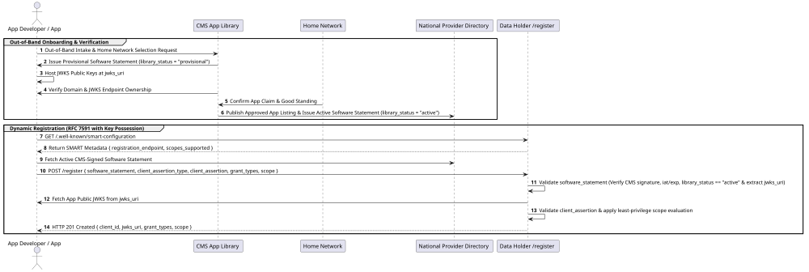
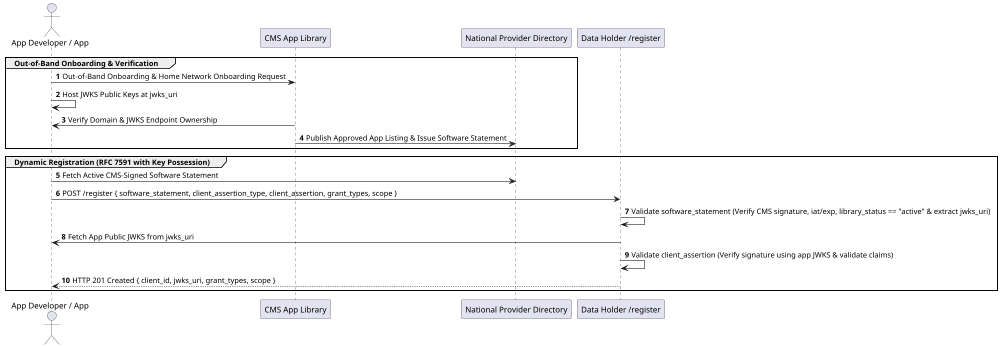

# Registration

This section specifies the dynamic client registration protocol for Client Applications connecting to Data Holders within a CMS-aligned network.

Registration **SHALL** be completed via direct presentation of a CMS Software Statement at each Data Holder via RFC 7591 Dynamic Client Registration with key-possession proof of client ownership.

---

## Architectural Onboarding & Protocol Overview

Prior to presenting software statements to individual Data Holders, an application developer undergoes an out-of-band onboarding process with the **CMS App Library**, which includes onboarding to a designated home network.

### Out-of-Band Onboarding & JWKS Ownership Verification
1. **Onboarding & Home Network Registration**: The application developer registers their organization and application out-of-band with the CMS App Library and joins a CMS-aligned home network.
2. **JWKS & Domain Ownership Verification**: Before any software statement is issued with an `"active"` status, the CMS App Library verifies the application's domain ownership and confirms that its public JSON Web Key Set (JWKS) is published and accessible at the specified `jwks_uri`.
3. **National Provider Directory Listing**: Once onboarding and JWKS ownership verification are complete, the CMS App Library issues software statements for the application's listing in the national provider directory.
4. **Direct Dynamic Registration with Key-Possession Proof**: Armed with an active CMS-signed software statement, the Client Application dynamically registers directly with each target Data Holder via RFC 7591, presenting a signed key-possession assertion (`client_assertion` and `client_assertion_type`) in the JSON request body to prove control of the private key matching the app's published `jwks_uri`.
5. **Network Standing & Out-of-Band Revocation**: CMS continuously verifies application standing out-of-band with aligned networks. If a home network marks an application as no longer in good standing due to instances of actual harm, security breaches, or major compliance failures (as opposed to minor operational disputes), CMS revokes the central CMS-issued software statement and updates the national status list.

### Protocol Sequence Diagram

<p align="center">
  
</p>



### Cross-Network & Multi-Network Registration

Because trust in this architecture is anchored in the central CMS-signed Software Statement and National Provider Directory (NPD) trust bundle, Client Applications are **not restricted** to registering exclusively with a single "home" network:

- **Federated Registration**: A registered Client Application MAY present its CMS-signed software statement to hit `POST /register` at **ANY CMS-aligned Network Broker, Clearinghouse, or Data Holder** across the United States.
- **Automated Trust Acceptance**: Responding Network Brokers and Data Holders **SHALL** accept and process valid CMS-signed software statements regardless of whether the application originated from a different network or region, issuing a local `client_id` via RFC 7591 without requiring manual onboarding or bilateral business contracts.

> [!TIP]
> **Developer Implementation Guidance: JWKS & Key Rotation**:
> - **Private Key & `kid` Matching**: Client Applications **SHALL** sign all `client_assertion` JWTs with a private key whose corresponding public key is published at the app's `jwks_uri`. The JOSE header of the `client_assertion` **SHALL** include a `kid` (Key ID) parameter matching the `kid` in the published JWKS.
> - **Key Rotation**: When rotating public keys at `jwks_uri`, applications SHOULD retain previous public keys for at least 24 hours to prevent registration or authentication failures during key cache propagation.

> [!NOTE]
> **Architectural Discussion Point: Direct DCR vs. Network Certificate Provisioning (FAST/UDAP Pivot)**:
> 
> The current specification defines dynamic client registration directly with individual Data Holders using CMS Software Statements and application-managed `jwks_uri` key possession.
> 
> **Why Direct Registration Remains Essential**:
> Because CMS itself operates as an out-of-band trust anchor—not an operational network node—onboarding to a single network hub does not automatically establish trust with standalone Data Holders or external networks. Direct Dynamic Registration using CMS Software Statements remains the fundamental baseline requirement for universal, cross-network connectivity.
> 
> **Pros of the Direct DCR Approach**:
> - **Zero Certificate Overhead**: Client Applications do not need to manage X.509 Certificate Signing Requests (CSRs) or complex client certificate lifecycles.
> - **Lightweight Dynamic Onboarding**: Applications can register dynamically with any Data Holder nationwide using standard Web PKI HTTPS and simple `private_key_jwt` signature verification.
> 
> **Complementary Network Certificate Provisioning (FAST/UDAP Alignment)**:
> Rather than completely replacing direct DCR, network certificate provisioning represents a potential complementary pattern: an application uses its CMS Software Statement to register with a specific Network Broker/Hub, which acts as an Intermediate CA to provision an X.509 Client Certificate. Within that specific network or TEFCA ecosystem, the application uses its network-issued certificate for mTLS and FAST/UDAP authentication, reducing repetitive registration overhead while preserving direct DCR for out-of-network Data Holders.

---

## Conformance Requirements

The official key words **MUST**, **MUST NOT**, **REQUIRED**, **SHALL**, **SHALL NOT**, **SHOULD**, **SHOULD NOT**, **RECOMMENDED**, **MAY**, and **OPTIONAL** in this document are to be interpreted as described in [RFC 2119](https://datatracker.ietf.org/doc/html/rfc2119) and [RFC 8174](https://datatracker.ietf.org/doc/html/rfc8174).

1. **Client Application Requirements**:
   - The Client Application **SHALL** complete out-of-band onboarding and JWKS ownership verification with the CMS App Library.
   - The Client Application **SHALL** obtain a valid, short-lived CMS-Signed Software Statement JWT from its approved listing in the national provider directory.
   - The Client Application **SHALL** present this software statement to each target Data Holder's OAuth 2.0 Dynamic Client Registration endpoint (`/register`).
   - The Client Application **SHALL** prove key possession during registration by including `client_assertion` and `client_assertion_type: urn:ietf:params:oauth:client-assertion-type:jwt-bearer` parameters in the JSON request body, signed with a private key whose corresponding public key is published at the app's `jwks_uri`.
   - The Client Application **SHALL** maintain its published JWKS at the verified `jwks_uri` endpoint.

2. **Data Holder & Network Broker Requirements**:
   - The Data Holder **SHALL** expose an RFC 7591 compliant endpoint (typically `/register`).
   - The Data Holder **SHALL** publish its dynamic registration endpoint in its `.well-known/openid-configuration` and `.well-known/oauth-authorization-server` metadata documents under the `registration_endpoint` claim.
   - The Data Holder **SHALL** validate the cryptographic signature of the `software_statement` using the public keys published by CMS.
   - The Data Holder **SHALL** verify the key-possession proof in the request body (`client_assertion`) by fetching the public keys from the client's `jwks_uri` (as declared in the software statement) and confirming the `client_assertion` signature.
   - The Data Holder **SHALL** verify that `extensions.cms_app.library_status` is `"active"`.
   - The Data Holder **SHALL** verify that the current timestamp is within the validity window defined by `iat` and `exp`.
   - The Data Holder **SHALL NOT** grant any `grant_type` in the registration response that is not present in `extensions.cms_app.allowed_grant_types` within the CMS-Signed `software_statement`. The requested `grant_types` **SHALL** be a subset of or equal to `extensions.cms_app.allowed_grant_types`.
   - If `scope` is omitted in the registration request, the Data Holder **SHOULD** default to the maximum permissible SMART scopes allowed for the application's `extensions.cms_app.app_class`.
   - The Data Holder **SHOULD NOT** allow the use of the `authorization_code` grant type if `redirect_uris` is not present in the registration request.
   - If a registration request contains an empty `grant_types` array (e.g., `[]`), the Data Holder **SHALL** cancel/deactivate the client's registration.
   - Network Brokers and Data Holders **SHALL** process RFC 7591 dynamic registration requests from any Client Application presenting a valid CMS-signed software statement, regardless of the application's primary network affiliation.
   - Upon successful verification, the Data Holder **SHALL** register or update the client, preserve the existing `client_id` binding if updating an existing `software_id`, and return a JSON response containing `client_id`, `grant_types`, `jwks_uri`, and registered `scope`.

---

## CMS-Signed Software Statement Specification

The CMS-Signed Software Statement is a signed JSON Web Token (JWT) issued by the CMS App Library that certifies the identity and compliance status of a software application.

### Software Statement JWT Header

| Header Parameter | Conformance | Type | Description |
| :--- | :--- | :--- | :--- |
| `alg` | **SHALL** | String | Digital signature algorithm. **SHALL** be `ES384` or `RS384`. |
| `kid` | **SHALL** | String | Key Identifier corresponding to the CMS signing key in the CMS JWKS. |
| `typ` | **SHALL** | String | Token type. **SHALL** be `JWT`. |

### Software Statement JWT Payload Claims

| Claim Name | Conformance | Type | Description |
| :--- | :--- | :--- | :--- |
| `software_id` | **SHALL** | String (URI) | Unique canonical identifier assigned to the application by CMS. |
| `client_name` | **SHALL** | String | Human-readable name of the client application. |
| `client_uri` | **SHOULD** | String (URL) | Home page URL of the client application. |
| `policy_uri` | **SHOULD** | String (URL) | URL for the application's privacy policy. |
| `contacts` | **SHALL** | Array of Strings | Array of email addresses for administrative contacts. |
| `token_endpoint_auth_method` | **SHALL** | String | Client authentication method. **SHALL** be `private_key_jwt`. |
| `jwks_uri` | **SHALL** | String (URL) | Public HTTPS endpoint where the app publishes its JWKS public keys. |
| `extensions.cms_app` | **SHALL** | Object | CMS-specific metadata object containing app status, classification, and allowed parameters. |
| `extensions.cms_app.version` | **SHALL** | String | Specification version (e.g., `"1"`). |
| `extensions.cms_app.library_status` | **SHALL** | String | CMS verification status. **SHALL** be `"active"`. |
| `extensions.cms_app.app_class` | **SHALL** | String | Classification of the app (e.g., `"patient-access-app"`). |
| `extensions.cms_app.allowed_grant_types` | **SHALL** | Array of Strings | Permitted OAuth 2.0 grant types allowed by CMS for this application (e.g., `["authorization_code", "refresh_token", "client_credentials", "urn:ietf:params:oauth:grant-type:token-exchange"]`). Requested grant types during registration SHALL be a subset of or equal to this array. |
| `iss` | **SHALL** | String (URI) | Issuer of the software statement (e.g., `https://library.medicare.gov`). |
| `sub` | **SHALL** | String (URI) | Subject identifier, matching `software_id`. |
| `aud` | **SHALL** | String (URI) | Intended audience (e.g., `https://framework.cms.gov/aligned-networks`). |
| `iat` | **SHALL** | Integer | Epoch timestamp when the statement was issued. |
| `exp` | **SHALL** | Integer | Epoch timestamp when the statement expires. |
| `jti` | **SHALL** | String | Unique JWT ID to prevent replay attacks. |

### Example Software Statement Payload

```json
{
  "software_id": "https://library.medicare.gov/app-library/apps/bp-buddy",
  "client_name": "BP Buddy",
  "client_uri": "https://bpbuddy.example",
  "policy_uri": "https://bpbuddy.example/privacy",
  "contacts": [
    "support@bpbuddy.example"
  ],
  "token_endpoint_auth_method": "private_key_jwt",
  "jwks_uri": "https://bpbuddy.example/.well-known/jwks.json",
  "extensions": {
    "cms_app": {
      "version": "1",
      "library_status": "active",
      "app_class": "patient-access-app",
      "allowed_grant_types": [
        "authorization_code",
        "refresh_token",
        "client_credentials",
        "urn:ietf:params:oauth:grant-type:token-exchange"
      ]
    }
  },
  "iss": "https://library.medicare.gov",
  "sub": "https://library.medicare.gov/app-library/apps/bp-buddy",
  "aud": "https://framework.cms.gov/aligned-networks",
  "iat": 1781817283,
  "exp": 1781903683,
  "jti": "20aab4ab-cf3b-4dd9-9518-309ab6034f88"
}
```

---

## Dynamic Client Registration (`/register`) Protocol

Client Applications **SHALL** register or update their registration dynamically with each target Data Holder by making an HTTP `POST` request to the Data Holder's `/register` endpoint (discovered via `.well-known` configuration metadata).

### Proof of Key Possession (`client_assertion`)

To prevent an attacker from copying a publicly accessible `software_statement` JWT from the National Provider Directory and attempting to register on behalf of another application, the Client Application **SHALL** present a self-contained Proof of Key Possession JWT using standard RFC 7523 `private_key_jwt` parameters inside the JSON request body.

The key-possession proof certifies that the entity initiating dynamic registration currently holds the private signing key corresponding to a public key published at the application's verified `jwks_uri` (as declared inside the `software_statement`).

The client sends these assertion parameters inside the JSON payload:
- `client_assertion_type`: `urn:ietf:params:oauth:client-assertion-type:jwt-bearer`
- `client_assertion`: `<key-possession-jwt>`

#### Cryptographic Binding & Signing Requirements

1. **Signing Key & Algorithm**: The key-possession assertion **SHALL** be signed using a private key whose public key counterpart is published at the client's `jwks_uri`. The signature algorithm (`alg`) **SHALL** be an approved digital signature algorithm (e.g. `ES384` or `RS384`).
2. **Key Identification (`kid`)**: The JWT JOSE header **SHALL** include a `kid` parameter matching the key identifier of the active public key in the client's JWKS.
3. **Payload Binding**: To cryptographically bind the proof of possession to the specific registration transaction and prevent token replay or payload substitution, the key-possession JWT **SHALL** bind the target Data Holder's endpoint URL and **SHOULD** include a SHA-256 hash of the `software_statement` JWT being presented.

#### Key-Possession JOSE Header Parameters

| Header Parameter | Conformance | Type | Description |
| :--- | :--- | :--- | :--- |
| `alg` | **SHALL** | String | Signature algorithm. **SHALL** match an algorithm supported by the app's JWKS (e.g., `ES384` or `RS384`). |
| `kid` | **SHALL** | String | Key Identifier of the public key hosted at the app's `jwks_uri`. |
| `typ` | **SHALL** | String | Token type. **SHALL** be `JWT`. |

##### Example Key-Possession JOSE Header

```json
{
  "alg": "ES384",
  "kid": "app-key-2026-01",
  "typ": "JWT"
}
```

#### Key-Possession JWT Payload Claims

| Claim Name | Conformance | Type | Description |
| :--- | :--- | :--- | :--- |
| `iss` | **SHALL** | String (URI) | Issuer of the assertion. **SHALL** match the `software_id` claim in the `software_statement`. |
| `sub` | **SHALL** | String (URI) | Subject of the assertion. **SHALL** match the `software_id` claim in the `software_statement`. |
| `aud` | **SHALL** | String (URI) | Audience of the assertion. **SHALL** match the Data Holder's `/register` endpoint URL. |
| `exp` | **SHALL** | Integer | Epoch timestamp when the assertion expires. **SHALL NOT** exceed 5 minutes from `iat`. |
| `iat` | **SHALL** | Integer | Epoch timestamp when the assertion was issued. |
| `jti` | **SHALL** | String | Unique nonce identifier generated for this registration request to prevent replay. |
| `software_statement_hash` | **SHOULD** | String | Base64URL-encoded SHA-256 hash (without padding) of the compact serialized `software_statement` string included in the request body (following JOSE/RFC 7638 conventions). |

##### Example Key-Possession Decoded Payload

```json
{
  "iss": "https://library.medicare.gov/app-library/apps/bp-buddy",
  "sub": "https://library.medicare.gov/app-library/apps/bp-buddy",
  "aud": "https://dataholder.example.org/oauth/register",
  "exp": 1781817583,
  "iat": 1781817283,
  "jti": "reg-nonce-88239102-4b2a",
  "software_statement_hash": "47DEQpj8HBSa-_TImW-5JCeuQeRkm5NMpJWZG3hSuFU"
}
```

#### Data Holder Key-Possession Verification Algorithm

Upon receiving a dynamic registration request (`POST /register`), the Data Holder **SHALL** perform key-possession verification through the following self-contained steps:

1. **Extract Assertion Parameters**: Read `client_assertion_type` and `client_assertion` from the JSON request body. If either parameter is missing or malformed, the Data Holder **SHALL** reject the request with `HTTP 400 Bad Request` (`error="invalid_request"`).
2. **Decode Software Statement**: Parse the `software_statement` parameter from the request body and verify the CMS digital signature using CMS public keys. Extract the verified `software_id` and `jwks_uri`.
3. **Validate Key-Possession Claims**:
   - Confirm `client_assertion_type` is `urn:ietf:params:oauth:client-assertion-type:jwt-bearer`.
   - Confirm `iss` and `sub` in the `client_assertion` JWT match the verified `software_id`.
   - Confirm `aud` matches the Data Holder's absolute `/register` endpoint URL.
   - Confirm current time is between `iat` and `exp`, and `exp - iat` $\le 300$ seconds.
   - Confirm `jti` has not been seen previously within the expiration window.
   - If `software_statement_hash` is present, compute `BASE64URL(SHA256(software_statement))` and verify it matches the claim value.
4. **Fetch & Verify Client Signature**:
   - Retrieve the client's public JWKS from the verified `jwks_uri` extracted from the software statement.
   - Locate the public key matching the `kid` specified in the `client_assertion` JOSE header.
   - Validate the signature of the `client_assertion` JWT using the retrieved public key.
5. **Registration Outcome & Error Codes**:
   - If all steps pass, key possession is proven. The Data Holder proceeds to register or update the client, preserving the existing `client_id` for an updated `software_id`.
   - If claim validation, signature check, or key resolution fails, the Data Holder **SHALL** reject the request with `HTTP 400 Bad Request` (`error="invalid_client_metadata"` or `error="unauthorized_client"`).

### HTTP Registration Request

- **HTTP Method**: `POST`
- **Content-Type**: `application/json`

#### Request Body Parameters

| Parameter | Conformance | Type | Location | Description |
| :--- | :--- | :--- | :--- | :--- |
| `software_statement` | **SHALL** | String (JWT) | Body | Compact serialized CMS-signed software statement JWT. |
| `client_assertion_type` | **SHALL** | String (URI) | Body | **SHALL** be `urn:ietf:params:oauth:client-assertion-type:jwt-bearer`. |
| `client_assertion` | **SHALL** | String (JWT) | Body | Compact serialized key-possession proof JWT signed by the client's private key matching `jwks_uri`. |
| `grant_types` | **SHALL** | Array of Strings | Body | Requested OAuth 2.0 grant types (e.g. `["authorization_code", "refresh_token", "client_credentials", "urn:ietf:params:oauth:grant-type:token-exchange"]`). **SHALL** be a subset of `extensions.cms_app.allowed_grant_types` in `software_statement`. If set to `[]`, the registration SHALL be canceled. |
| `token_endpoint_auth_method` | **SHALL** | String | Body | Client authentication method. **SHALL** be `private_key_jwt`. |
| `client_id` | **MAY** | String | Body | Previously issued client identifier. If present during re-registration, the Data Holder **SHALL** verify that it matches the `client_id` previously issued by the Data Holder for the specified `software_id`. |
| `scope` | **MAY** | String | Body | Space-delimited list of requested SMART and system scopes (e.g. `patient/*.rs system/Patient.rs launch/patient openid fhirUser`). If omitted, Data Holder SHOULD default to maximum allowed scopes for the `app_class`. |
| `redirect_uris` | **CONDITIONALLY SHALL** | Array of Strings | Body | Array of redirection URIs. **REQUIRED** if `authorization_code` is included in `grant_types`. Data Holders **SHOULD NOT** allow authorization code grant execution if `redirect_uris` is omitted. |

#### Example Registration Request

```http
POST /oauth/register HTTP/1.1
Host: dataholder.example.org
Content-Type: application/json

{
  "software_statement": "eyJhbGciOiJFUzM4NCIsImtpZCI6Ijd0RmY4di0t...[software-statement-jwt]...",
  "client_assertion_type": "urn:ietf:params:oauth:client-assertion-type:jwt-bearer",
  "client_assertion": "eyJhbGciOiJFUzM4NCIsImtpZCI6ImFwcC1rZXktMSJd...[key-possession-jwt]...",
  "grant_types": [
    "authorization_code",
    "refresh_token",
    "client_credentials",
    "urn:ietf:params:oauth:grant-type:token-exchange"
  ],
  "token_endpoint_auth_method": "private_key_jwt",
  "scope": "patient/*.rs system/Patient.rs launch/patient openid fhirUser",
  "redirect_uris": [
    "https://bpbuddy.example/oauth/callback"
  ]
}
```

---

### HTTP Registration Response

Upon successful validation of the software statement, key-possession proof, and requested parameters, the Data Holder **SHALL** respond with HTTP status `201 Created` (for new registrations) or `200 OK` (when updating an existing registration) and return the registration metadata in the body.

#### Response Parameters

| Parameter | Conformance | Type | Description |
| :--- | :--- | :--- | :--- |
| `client_id` | **SHALL** | String | Unique client identifier issued by the Data Holder for this client. When updating an existing registration, the Data Holder **SHALL** return the identical `client_id`. |
| `software_id` | **SHALL** | String (URI) | The `software_id` extracted from the software statement. |
| `grant_types` | **SHALL** | Array of Strings | Granted OAuth 2.0 grant types (**SHALL** be a subset of `extensions.cms_app.allowed_grant_types` in `software_statement`). |
| `token_endpoint_auth_method` | **SHALL** | String | Authenticating method (e.g., `private_key_jwt`). |
| `jwks_uri` | **SHALL** | String (URL) | The verified `jwks_uri` bound to the client registration. |
| `scope` | **SHALL** | String | Space-delimited list of registered/granted SMART scopes. |
| `redirect_uris` | **CONDITIONALLY SHALL** | Array of Strings | Registered redirection URIs for `authorization_code` flows. |

#### Example Registration Response

```http
HTTP/1.1 201 Created
Content-Type: application/json
Cache-Control: no-store

{
  "client_id": "dh_client_982347102934",
  "software_id": "https://library.medicare.gov/app-library/apps/bp-buddy",
  "grant_types": [
    "authorization_code",
    "refresh_token",
    "client_credentials",
    "urn:ietf:params:oauth:grant-type:token-exchange"
  ],
  "token_endpoint_auth_method": "private_key_jwt",
  "jwks_uri": "https://bpbuddy.example/.well-known/jwks.json",
  "scope": "patient/*.rs system/Patient.rs launch/patient openid fhirUser",
  "redirect_uris": [
    "https://bpbuddy.example/oauth/callback"
  ]
}
```
1. **Extract Assertion Parameters**: Read `client_assertion_type` and `client_assertion` from the JSON request body. If either parameter is missing or malformed, the Data Holder **SHALL** reject the request with `HTTP 400 Bad Request` (`error="invalid_request"`).
2. **Verify Assertion Type**: Confirm `client_assertion_type` is `urn:ietf:params:oauth:client-assertion-type:jwt-bearer`.
3. **Verify Key-Possession JWT**:
   - Resolve the client's `jwks_uri` from the submitted `software_statement`.
   - Fetch the client's JWKS and locate the public key matching the `kid` in the key-possession JWT header.
   - Verify the digital signature of `client_assertion`.
   - Confirm `iss` and `sub` match `software_id` in `software_statement`.
   - Confirm `aud` matches the Data Holder's `/register` endpoint URL.
   - Confirm current time is within `iat` and `exp` lifetime window (maximum 5-minute lifespan).
   - If claim validation, signature check, or key resolution fails, the Data Holder **SHALL** reject the request with `HTTP 400 Bad Request` (`error="invalid_client_metadata"` or `error="unauthorized_client"`).

---

### Data Holder `.well-known` Configuration Requirements

Data Holders **SHALL** publish their dynamic client registration endpoint and capabilities in standard OAuth 2.0 / OpenID Connect discovery documents:

1. **OAuth 2.0 Authorization Server Metadata (`.well-known/oauth-authorization-server`)**:
   - `registration_endpoint`: **SHALL** contain the absolute URL of the Data Holder's RFC 7591 dynamic client registration endpoint (e.g., `https://dataholder.example.org/oauth/register`).
   - `grant_types_supported`: **SHALL** include `authorization_code`, `refresh_token`, and `urn:ietf:params:oauth:grant-type:token-exchange`. Additionally, `grant_types_supported` **SHALL** include `client_credentials` if the Data Holder exposes its Record Location Service (RLS) / Patient Discovery endpoint directly.
   - `token_endpoint_auth_methods_supported`: **SHALL** include `private_key_jwt`.

2. **OpenID Provider Configuration Information (`.well-known/openid-configuration`)**:
   - **SHALL** mirror all parameters listed above, and specifically include:
     - `token_endpoint`: **SHALL** contain the absolute URL of the OAuth 2.0 token endpoint (e.g., `https://dataholder.example.org/oauth/token`).
     - `authorization_endpoint`: **SHALL** contain the absolute URL of the OAuth 2.0 authorization endpoint (e.g., `https://dataholder.example.org/oauth/authorize`).
     - `registration_endpoint`: **SHALL** contain the absolute URL of the RFC 7591 dynamic client registration endpoint.
     - `grant_types_supported`: **SHALL** include `authorization_code`, `refresh_token`, and `urn:ietf:params:oauth:grant-type:token-exchange` (and `client_credentials` if RLS is exposed directly).
     - `token_endpoint_auth_methods_supported`: **SHALL** include `private_key_jwt`.
     - `capabilities`: **SHALL** include `launch-standalone`, `client-confidential-symmetric` (or key-based auth), `permission-v2`, `context-standalone-patient`, and `permission-offline` (if refresh tokens are supported for offline access).
     - `scopes_supported`: **SHALL** include supported SMART v2 scopes (e.g. `patient/*.rs`, `user/*.rs`, `openid`, `fhirUser`, `offline_access`).

---

### Key Rotation & Metadata Updates

#### Public Key Rotation (`jwks_uri`)

Client Applications manage cryptographic key rotation seamlessly through their `jwks_uri`:

1. Key rotation does **not** require re-issuing software statements or re-registering with Data Holders.
2. The Client Application publishes the new public key alongside existing public keys at its `jwks_uri`.
3. When requesting access tokens or making registration calls, the Client Application signs authentication/possession JWTs using the new key's `kid`.
4. The Data Holder fetches the latest JWKS from `jwks_uri`, resolves the new `kid`, and verifies the signature dynamically.

### Application & Scope Metadata Updates (Re-registration)

If a Client Application's metadata or requested scope set changes (e.g., updated `client_name`, expanded `scope`, or relocated `jwks_uri`), the client **MAY** update its registration by re-submitting an updated registration payload:

1. **Re-registration Submission**: The client issues an HTTP `POST` to `/register` presenting an updated `software_statement` and/or modified `scope`, `grant_types`, and `redirect_uris`. The client MAY include its previously assigned `client_id` in the request body.
2. **Data Holder Processing & Client ID Persistence**: The Data Holder **SHALL** match the registration request against existing client registrations using `software_id` (or `client_id`), verify the CMS signature and key-possession proof, update client metadata and scopes in its registry, and **SHALL** maintain the identical `client_id` binding.
3. **Registration Cancellation / Deactivation**: If a client sends a registration request containing an empty `grant_types: []` array, the Data Holder **SHALL** interpret this as an explicit request to cancel/deactivate the client's registration and **SHALL** reject subsequent token requests for that `client_id`.
4. **Client Management Endpoints (RFC 7592)**: RFC 7592 client management endpoints (`GET`/`PUT`/`DELETE` `/register/{client_id}`) are **out of scope** at this time. All registration updates and cancellations SHALL be handled via `/register` re-registration calls.

---

## Data Holder Responsibilities: Ongoing Verification & Revocation Synchronization

Data Holders **SHALL** enforce ongoing verification of registered Client Applications to ensure that revoked or compromised software statements are promptly decommissioned, mitigating stale registration risks without degrading system performance during routine token exchanges.

### Software Statement Validity & Lifespan Bounds

1. **Software Statement Expiration**: CMS Software Statements **SHALL** contain an explicit `exp` claim. The lifespan of a software statement (`exp - iat`) **SHALL NOT** exceed **24 hours** (86,400 seconds).
2. **Registration Verification**: Upon receiving a dynamic registration request (`POST /register`), Data Holders **SHALL** verify that `extensions.cms_app.library_status` is `"active"` and that the current timestamp is within the validity window defined by `iat` and `exp`.

### Compressed Bitstring Status List Synchronization (RFC 9493)

To ensure privacy-preserving status verification and prevent CMS directory endpoint bottlenecks, application revocation status **SHALL** be synchronized using the CMS Compressed Bitstring Status List (`.well-known/status-list.json`).

1. **Status List Retrieval**: Data Holders **SHALL** fetch and cache the CMS Compressed Bitstring Status List from `https://directory.cms.gov/.well-known/status-list.json` at least once every **60 minutes**.
2. **Bitwise Status Evaluation**: Data Holders **SHALL** evaluate an application's operational status by performing a 0-millisecond bitwise check matching the `status_list_index` assigned in the application's registration metadata:
   - **Bit `0` (Active)**: The client's registration remains valid.
   - **Bit `1` (Revoked/Inactive)**: The client's registration **SHALL** be revoked immediately.
3. **Local Cache Execution**: As long as the cached status list remains unexpired and the application's bit evaluates to `0`, Data Holders **SHALL** process OAuth 2.0 token exchanges (`POST /token`) locally without initiating outbound network calls.

> [!NOTE]
> **Architectural Discussion Point: Network Failure Handling**:
> Operational policies for handling network partitions or status list retrieval failures (such as stale status grace windows versus fail-closed cut-offs) have not yet been finalized and remain an active area of network discussion.

### Out-of-Band Network Standing & Central Revocation Cascade

CMS maintains out-of-band communication processes with aligned home networks to continuously verify that registered applications maintain good standing across participating network brokers and clearinghouses.

- **Scope & Threshold for Revocation**: Revocation of a CMS-issued Software Statement is strictly reserved for instances of **actual harm, severe security incidents, privacy breaches, or major compliance failures**, rather than minor operational, administrative, or commercial disputes between an application developer and a network.
- **Central Status List Update**: When a home network reports out-of-band that an application has engaged in conduct causing actual harm or critical security violations, CMS revokes the central Software Statement and flips the application's bit from `0` (Active) to `1` (Revoked) in the CMS Compressed Bitstring Status List (`.well-known/status-list.json`).
- **Nationwide Enforcement**: Because Data Holders synchronize with the CMS Bitstring Status List, revocation by CMS transparently cascades nationwide to all Data Holders without requiring Data Holders to maintain direct integrations or status checks with individual networks.

### Automated Revocation Cascade

If the bitstring status list check (or targeted fallback query) indicates that an application's status is no longer active (bit evaluates to `1` or directory returns HTTP 404/revoked):

1. **Client Deactivation**: The Data Holder **SHALL** immediately set the local client status to `revoked` / `deactivated`.
2. **Token Invalidation**: The Data Holder **SHALL** immediately invalidate and revoke all active Refresh Tokens and Access Tokens associated with that `client_id`.
3. **Rejection of Future Requests**: The Data Holder **SHALL** reject subsequent `POST /token` requests for that `client_id` with `HTTP 401 Unauthorized` (`error="invalid_client"`).
```
